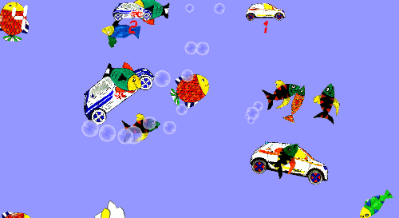
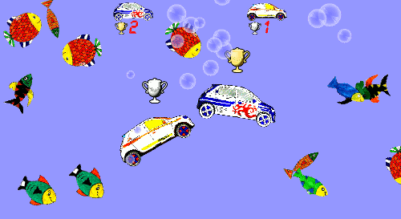

# cars




A simple multiplayer 2D game where each player controls a car.
He or she must get as many candies as possible before the others do.
The world is set in a submarine environment.
The graphics are based on scanned children drawings of cars and fishes.
The sounds are borrowed from the amazing [SuperTuxKart](http://supertuxkart.sourceforge.net/).

License :                  see the LICENSE file.

Authors :                  see the AUTHORS file.

How to build the program
========================

You need the following libraries before compiling :

  * cmake  ( ```sudo apt-get install cmake``` ),
  * SDL ( ```sudo apt-get install libsdl2-gfx-dev libsdl2-image-dev  libsdl2-mixer-dev  libsdl2-ttf-dev``` )

The project is based on a CMakeLists.
It is easy to build the program on a Unix computer.
Go in the source folder and type:
```bash
$ mkdir build
$ cd build
$ cmake ..
$ make
```

How to use the program
=======================
To display the help, just launch the program in a terminal.
It will display the help of the program.

```
Synposis: cars winw winh [players_names]
  winw:     window width  in pixels [default: 800]
  winh:     window height in pixels [default: 600]
  player_names: names of players, between 1 and 10
    possible choices: 2cv  cabrio  twingo_ainara  twingo_arnaud  twingo_red  twingo_unai
    default: "twingo_arnaud twingo_unai"
```


Credits
=======

Fonts
----

  - `fonts/DejaVuSans-Bold.ttf`:
    included in Ubuntu.

  - `fonts/LCD2U___.TTF`:    [myfontfree.com](http://www.myfontfree.com/lcd2-myfontfreecom55f70418.htm)

Graphics
--------

  - `graphics/bubble.png`:
    [openclipart.org](https://openclipart.org/detail/195743/bubble)

  - `graphics/candy/*, graphics/fish/*`:
    homemade

  - `graphics/cars/2cv*:
    [openclipart.org](https://openclipart.org/detail/202003/2cv)

  - `graphics/cars/cabrio*`:
    [openclipart.org](https://openclipart.org/detail/170838/black-cabrio-side-view)

  - `graphics/cars/Tire_Side_View.*`:
    [openclipart.org](https://openclipart.org/detail/171197/simple-car-wheeltire-side-view)

  - `graphics/cars/twingo*`:
    homemade

  - `graphics/cup_*.png`:
    [supertuxkart.sourceforge.net](http://supertuxkart.sourceforge.net/)

Music
-----

  - `music/cocoa_river.ogg`:
    [supertuxkart.sourceforge.net](http://supertuxkart.sourceforge.net/)

  - `music/unai_arnaud.flac`:
    homemade

Sounds
------

  - `sounds/*`:
    [supertuxkart.sourceforge.net](http://supertuxkart.sourceforge.net/)
